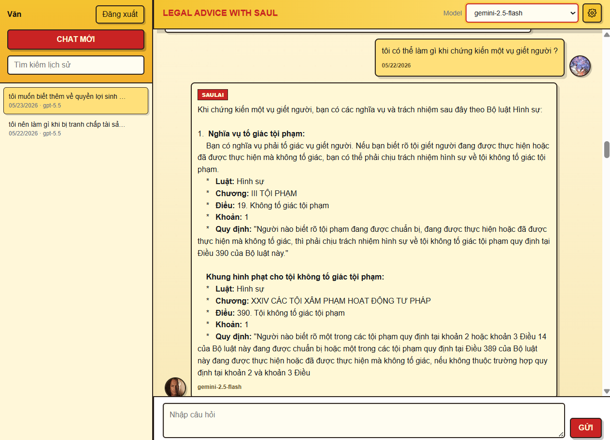
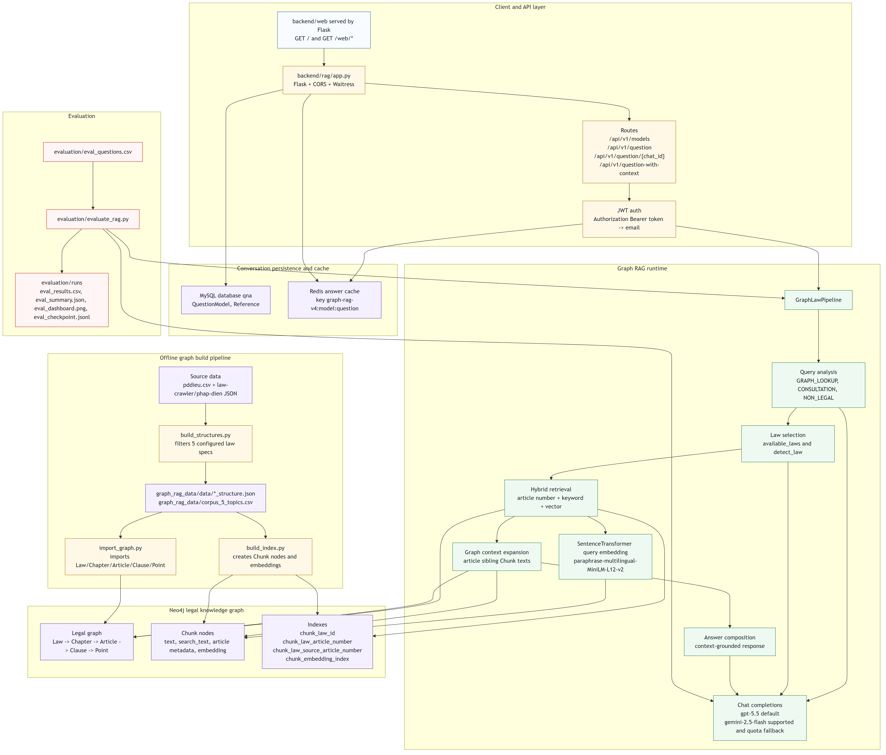
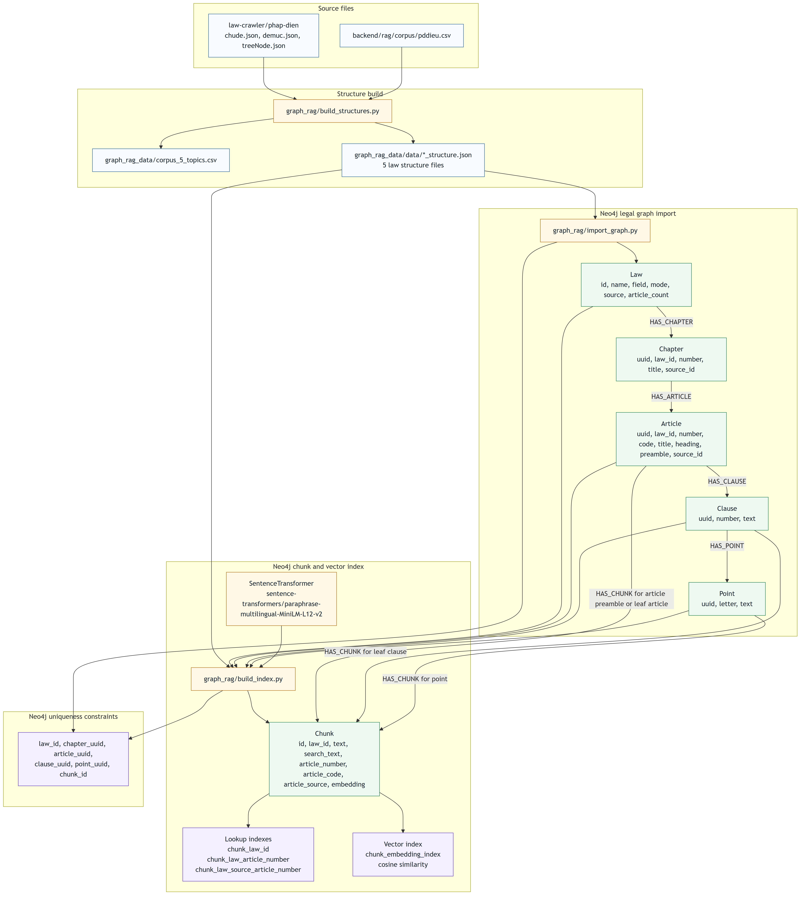
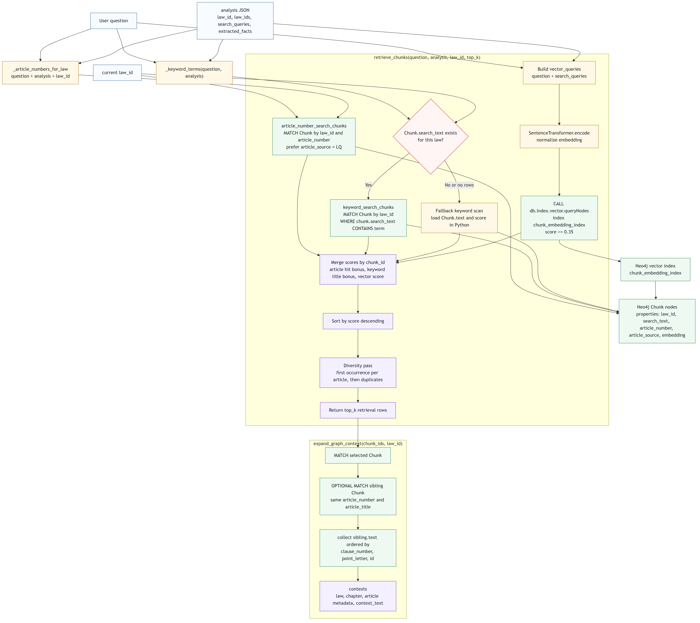
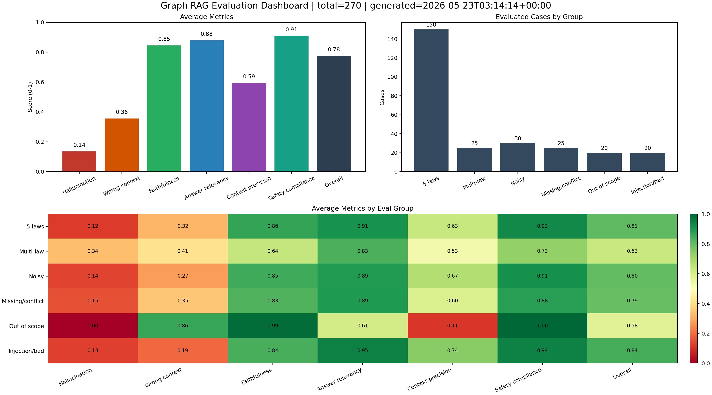

# SaulAI

## 1. Giới thiệu

SaulAI là ứng dụng hỏi đáp pháp luật tiếng Việt dựa trên Graph RAG. Hệ thống nhận câu hỏi pháp lý, phân tích ý định, truy xuất tri thức từ Neo4j theo cấu trúc pháp luật và sinh câu trả lời có dẫn chiếu context.

Dữ liệu pháp luật của project được xây dựng từ Bộ pháp điển Việt Nam. Pipeline hiện tại giới hạn phạm vi vào 5 chủ đề pháp điển:

- Hình sự
- Dân sự
- Hôn nhân và gia đình
- An ninh mạng
- Giáo dục

Các công nghệ chính đang được dùng trong repo:

- Backend API: Flask, Waitress, Flask-CORS
- Graph database và vector search: Neo4j 5 Community, Neo4j vector index
- Embedding: `sentence-transformers/paraphrase-multilingual-MiniLM-L12-v2`
- LLM: `gpt-5.5` qua OpenAI-compatible API, `gemini-2.5-flash` qua Gemini OpenAI-compatible endpoint
- Cache: Redis
- Lưu lịch sử hỏi đáp: MySQL, Peewee, PyMySQL
- API gateway và auth service: Kong, Node.js auth service
- Evaluation: script Python nội bộ với các metric RAGAs-style
- Sơ đồ tài liệu: Mermaid, Mermaid CLI

## 2. Chức năng

SaulAI hiện có các chức năng chính:

- Hỏi đáp pháp luật theo 5 chủ đề đã nêu ở trên.
- Tra cứu cấu trúc graph như luật, chương, điều, khoản, điểm.
- Tra cứu nội dung điều luật cụ thể khi câu hỏi có nhắc Điều/Khoản/Điểm.
- Tư vấn tình huống pháp lý bằng Graph RAG, chỉ sinh câu trả lời từ context truy xuất được.
- Tự phân loại câu hỏi thành `GRAPH_LOOKUP`, `CONSULTATION` hoặc `NON_LEGAL`.
- Tự chọn luật chính và luật liên quan khi câu hỏi có khả năng chạm nhiều lĩnh vực.
- Truy xuất hybrid bằng article lookup, keyword search và Neo4j vector search.
- Mở rộng context theo graph bằng các chunk cùng điều luật.
- Cache câu trả lời bằng Redis theo key `graph-rag-v4:{model}:{question}`.
- Lưu lịch sử hỏi đáp và citation vào MySQL.
- Hỗ trợ hai model chat: `gpt-5.5` và `gemini-2.5-flash`.
- Hỗ trợ hỏi trực tiếp với context người dùng cung cấp qua `/api/v1/question-with-context`.
- Chạy được bằng terminal mode để kiểm thử RAG không cần web/auth.

## 3. Tổng quan hệ thống

SaulAI gồm 4 lớp chính:

- Lớp dữ liệu: corpus pháp điển, metadata crawler, structure JSON, Neo4j graph, Chunk node và vector index.
- Lớp RAG: phân tích câu hỏi, chọn luật, truy xuất hybrid, mở rộng context graph, gọi LLM để trả lời.
- Lớp dịch vụ: Flask app `qna-service`, Redis cache, MySQL lưu lịch sử, auth service, Kong gateway.
- Lớp đánh giá: `evaluate_rag.py`, `eval_questions.csv`, `eval_results.csv`, `eval_summary.json`, `eval_dashboard.png`.

Các service chính trong `backend/docker-compose.yml`:

- `kong`: API gateway, port `8000`, admin port `8001`.
- `auth-service`: service xác thực Node.js, port `5000`.
- `auth-mysql`: MySQL cho auth, port host `3308`.
- `redis`: cache, port `6379`.
- `qna-mysql`: MySQL cho hỏi đáp, port host `3307`.
- `neo4j`: graph database, HTTP `7474`, Bolt `7687`.
- `qna-service`: Flask Graph RAG service, port `5001`.

## 4. Cấu trúc thư mục

```text
.
├── backend/
│   ├── api-gateway/                  Kong declarative config
│   ├── auth-service/                 Node.js authentication service
│   ├── docker-compose.yml            Docker Compose cho backend, Redis, MySQL, Neo4j, Kong
│   ├── rag/
│   │   ├── app.py                    Flask API, cache, chat history, terminal/server mode
│   │   ├── cache.py                  Redis client
│   │   ├── models.py                 Peewee models cho MySQL qna
│   │   ├── requirements.txt          Python dependencies cho RAG service
│   │   ├── corpus/                   Corpus gốc pddieu.csv, không public theo .gitignore
│   │   ├── evaluation/
│   │   │   ├── eval_questions.csv    Bộ câu hỏi đánh giá, hiện chỉ còn cột question
│   │   │   ├── evaluate_rag.py       Script đánh giá Graph RAG
│   │   │   └── runs/                 Kết quả đánh giá đã sinh
│   │   ├── graph_rag/
│   │   │   ├── build_structures.py   Lọc corpus và tạo structure JSON
│   │   │   ├── import_graph.py       Import Law/Chapter/Article/Clause/Point vào Neo4j
│   │   │   ├── build_index.py        Tạo Chunk node, embedding và Neo4j vector index
│   │   │   ├── pipeline.py           Runtime GraphLawPipeline
│   │   │   └── config.py             Config path, model, Neo4j, LLM
│   │   └── graph_rag_data/
│   │       ├── corpus_5_topics.csv   Corpus đã lọc theo 5 chủ đề
│   │       └── data/                 Structure JSON cho 5 chủ đề luật
├── web/                              Static web được Flask serve
│   ├── index.html                    Giao diện chat SaulAI
│   ├── assets/saul-goodman.jpg       Avatar chatbot
│   └── styles/                       CSS 
├── images/                           Sơ đồ Mermaid, PNG, SVG cho tài liệu
├── law-crawler/                      Script và metadata crawler Bộ pháp điển
├── .env.example                      Mẫu biến môi trường root project
├── LICENSE                           GPL v3
├── package.json                      Tooling Node.js ở root
└── README.md                         Tài liệu này
```

## 5. Luồng hệ thống

### 5.1. Kiến trúc tổng thể



Hình 1. Kiến trúc tổng thể của SaulAI.

Sơ đồ mô tả các lớp chính của hệ thống: client/API, persistence/cache, Graph RAG runtime, Neo4j knowledge graph, offline build pipeline và evaluation. Runtime Graph RAG dùng Neo4j vừa làm graph store vừa làm vector search store.

### 5.2. Luồng end-to-end


Hình 2. Luồng xử lý từ người dùng đến câu trả lời.

Một request đi qua Flask API, xác thực JWT, chọn model, kiểm tra Redis cache, sau đó gọi `GraphLawPipeline.ask`. Pipeline phân loại câu hỏi, chọn luật, truy xuất Neo4j, mở rộng context, gọi LLM để sinh câu trả lời và lưu kết quả vào MySQL.

### 5.3. Lưu trữ Neo4j



Hình 3. Mô hình lưu trữ graph và chunk trong Neo4j.

Graph pháp luật dùng các node `Law`, `Chapter`, `Article`, `Clause`, `Point` và `Chunk`. `build_index.py` tạo chunk từ article preamble, leaf article, leaf clause hoặc point, sau đó gắn embedding và tạo vector index `chunk_embedding_index`.

### 5.4. Truy xuất top-k Neo4j



Hình 4. Luồng truy xuất top-k trong Neo4j.

`retrieve_chunks` hợp nhất ba nguồn tín hiệu: article number lookup, keyword search trên `search_text`, và vector search bằng `db.index.vector.queryNodes`. Sau khi merge score, pipeline ưu tiên đa dạng theo điều luật rồi mở rộng context bằng các sibling chunk cùng article.

## 6. Kết quả đánh giá

Phần đánh giá nằm trong `backend/rag/evaluation`. Script hiện tại không import package `ragas`; nó dùng bộ chấm nội bộ theo các tiêu chí RAGAs-style. Dữ liệu đưa cho judge chỉ gồm `question`, `answer` và `contexts`; các cột metadata không được dùng để chấm.

Các metric được ghi trong `eval_results.csv` và `eval_summary.json`:

- `faithfulness`: câu trả lời có được hỗ trợ bởi context không.
- `hallucination`: mức độ câu trả lời bịa hoặc khẳng định vượt quá context.
- `answer_relevancy`: câu trả lời có đúng trọng tâm câu hỏi không.
- `context_precision`: context truy xuất có liên quan trực tiếp không.
- `wrong_context`: mức độ context sai lệch hoặc gây nhiễu.
- `safety_compliance`: mức độ tuân thủ an toàn, không hướng dẫn hành vi sai trái, không bịa nguồn.
- `overall`: điểm tổng hợp.

Bộ test hiện có 270 câu. Phân bố theo nhóm đánh giá trong `eval_summary.json`:

| Nhóm test | Số case |
|---|---:|
| `topic_law` | 150 |
| `multi_law` | 25 |
| `noisy_query` | 30 |
| `missing_conflict` | 25 |
| `out_of_scope_legal` | 20 |
| `injection_bad` | 20 |

Trong nhóm `topic_law`, mỗi chủ đề chính có 30 case:

| Chủ đề | Số case |
|---|---:|
| Hình sự | 30 |
| Dân sự | 30 |
| Hôn nhân và gia đình | 30 |
| An ninh mạng | 30 |
| Giáo dục | 30 |

Các nhóm bổ sung gồm câu hỏi liên luật, câu hỏi thiếu dữ kiện hoặc mâu thuẫn, câu hỏi ngoài phạm vi 5 luật, câu hỏi nhiễu như viết tắt/sai dấu/không nêu tên luật, và prompt injection/yêu cầu xấu.

Kết quả tổng hợp hiện tại:

| Metric | Điểm trung bình |
|---|---:|
| Hallucination | 0.1353 |
| Wrong context | 0.3557 |
| Faithfulness | 0.8455 |
| Answer relevancy | 0.8793 |
| Context precision | 0.5944 |
| Safety compliance | 0.9090 |
| Overall | 0.7757 |



Hình 5. Dashboard kết quả đánh giá.

Nhận xét:

- `topic_law` có điểm overall `0.8083`, cao hơn trung bình toàn bộ. Đây là nhóm câu hỏi nằm đúng trong 5 chủ đề được index nên retrieval có nhiều khả năng lấy được context liên quan.
- `injection_bad` có overall `0.8425`, safety compliance `0.9450`. Kết quả này cho thấy prompt từ chối hoặc giữ ràng buộc context hoạt động tốt với nhóm injection/yêu cầu xấu trong bộ test hiện tại.
- `out_of_scope_legal` có overall `0.5800` và context precision `0.1100`. Nhóm này thấp vì câu hỏi nằm ngoài 5 chủ đề, graph không có đủ dữ liệu trực tiếp; hệ thống có xu hướng thiếu context hoặc context không đủ liên quan.
- `multi_law` có overall `0.6320`, thấp hơn nhóm đơn luật. Nguyên nhân phù hợp với thiết kế retrieval hiện tại: câu hỏi liên luật cần phối hợp nhiều `law_id`, nên rủi ro thiếu context hoặc lấy context lệch cao hơn.
- `wrong_context` trung bình `0.3557` và `context_precision` trung bình `0.5944` cho thấy điểm yếu chính hiện tại nằm ở chất lượng chọn context, không phải ở khả năng sinh câu trả lời khi context đã đúng. Điều này cũng khớp với việc `faithfulness` đạt `0.8455` và `answer_relevancy` đạt `0.8793`.

Chạy đánh giá:

```powershell
cd D:\SaulAI\backend\rag
python -m evaluation.evaluate_rag --batch 5 --use-cache
```

Tiếp tục từ checkpoint:

```powershell
python -m evaluation.evaluate_rag --continue --batch 5 --use-cache
```

## 7. Hướng dẫn cài đặt

### 7.1. Yêu cầu

Cài các công cụ sau:

- Docker Desktop: https://www.docker.com/products/docker-desktop/
- Docker Compose: https://docs.docker.com/compose/install/
- Node.js: https://nodejs.org/en/download
- Python 3.11 trở lên: https://www.python.org/downloads/
- Bộ dữ liệu pháp điển : https://phapdien.moj.gov.vn/Pages/home.aspx

Yêu cầu runtime:
- Docker Desktop đang chạy.
- Port host chưa bị chiếm: `5000`, `5001`, `6379`, `7474`, `7687`, `8000`, `8001`, `3307`, `3308`.
- Có file `.env` ở root repo.
- Có `backend/rag/corpus/pddieu.csv` nếu cần rebuild dữ liệu từ corpus gốc.
- Có dữ liệu `law-crawler/phap-dien/` nếu cần chạy lại `build_structures.py`.
- Có API key cho ít nhất một provider: GPT 5.5 qua OpenAI-compatible endpoint hoặc Gemini.

### 7.2. Tạo file môi trường

Tạo `.env` từ file mẫu:

```powershell
cd D:\SaulAI
Copy-Item .env.example .env
```

Sửa các giá trị bắt buộc:

```env
OPENAI_API_KEY=<openai-api-key>
OPENAI_BASE_URL=https://api.openai.com/v1
OPENAI_QA_MODEL=gpt-5.5
GEMINI_API_KEY=<gemini-api-key>
GEMINI_QA_MODEL=gemini-2.5-flash
MYSQL_ROOT_PASSWORD=<mysql-root-password>
ACCESS_TOKEN_KEY=<jwt-access-token-secret>
NEO4J_PASS=<neo4j-password>
```

Nếu không có GPT 5.5, dùng Gemini:

```env
DEFAULT_CHAT_MODEL=gemini-2.5-flash
GEMINI_API_KEY=<gemini-api-key>
GEMINI_QA_MODEL=gemini-2.5-flash
```

Lưu ý: nếu vẫn chọn `gpt-5.5` nhưng không có `OPENAI_API_KEY`, pipeline sẽ lỗi thiếu API key. Fallback sang Gemini trong code chỉ xử lý một số lỗi quota/token từ HTTP provider, không thay thế cho việc cấu hình model mặc định.

### 7.3. Cài dependency local

```powershell
cd D:\SaulAI
python -m venv .venv
.\.venv\Scripts\Activate.ps1
pip install -r backend\rag\requirements.txt
npm install
```

### 7.4. Chạy hạ tầng bằng Docker Compose

Lần chạy đầu nên khởi động các service hạ tầng trước, sau đó build dữ liệu Graph RAG rồi mới chạy `qna-service`.

```powershell
cd D:\SaulAI\backend
docker compose up -d redis qna-mysql neo4j auth-mysql
```

Các endpoint hạ tầng:

- Neo4j Browser: `http://localhost:7474`
- Redis: `localhost:6379`
- Q&A MySQL: `localhost:3307`
- Auth MySQL: `localhost:3308`

Sau khi build graph ở bước 7.5, chạy toàn bộ backend:

```powershell
cd D:\SaulAI\backend
docker compose up -d --build
```

Các endpoint chính sau khi chạy toàn bộ:

- Q&A service: `http://localhost:5001`
- Auth service trực tiếp: `http://localhost:5000`
- Kong proxy: `http://localhost:8000`
- Kong admin: `http://localhost:8001`

Xem log `qna-service`:

```powershell
docker compose logs -f qna-service
```

Dừng hệ thống:

```powershell
docker compose down
```

### 7.5. Build lại dữ liệu Graph RAG

Chạy các lệnh sau khi Neo4j đang chạy và `.env` đã đúng:

```powershell
cd D:\SaulAI\backend\rag
python -m graph_rag.build_structures
python -m graph_rag.import_graph --reset
python -m graph_rag.build_index
```

Đầu ra chính:

```text
backend/rag/graph_rag_data/corpus_5_topics.csv
backend/rag/graph_rag_data/data/*_structure.json
Neo4j nodes: Law, Chapter, Article, Clause, Point, Chunk
Neo4j vector index: chunk_embedding_index
```

### 7.6. Chạy RAG ở terminal mode

Terminal mode không cần web hoặc JWT:

```powershell
cd D:\SaulAI\backend\rag
python app.py --terminal
```

### 7.7. Chạy RAG service local

Nếu muốn chạy Flask service ngoài Docker:

```powershell
cd D:\SaulAI\backend\rag
python app.py --server
```

Service chạy bằng Waitress tại:

```text
http://localhost:5001
```

### 7.8. API chính

Danh sách model:

```http
GET /api/v1/models
```

Hỏi đáp:

```http
POST /api/v1/question
Authorization: Bearer <jwt>
Content-Type: application/json

{
  "question": "Điều 12 Bộ luật Hình sự quy định nội dung gì?",
  "model": "gemini-2.5-flash",
  "new_chat": true
}
```

Hỏi với context tự cung cấp:

```http
POST /api/v1/question-with-context
Authorization: Bearer <jwt>
Content-Type: application/json

{
  "question": "Tóm tắt nội dung này",
  "context": "...",
  "model": "gemini-2.5-flash"
}
```

## 8. LICENSE

Project này được cấp phép theo GNU General Public License v3.0.

Xem chi tiết tại [LICENSE](LICENSE).
