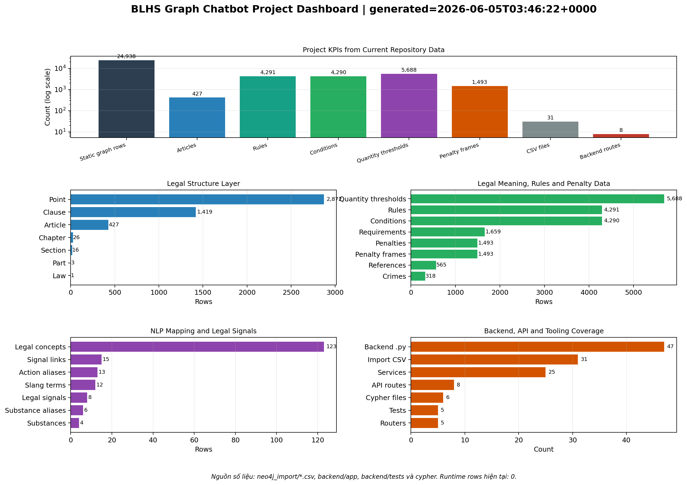
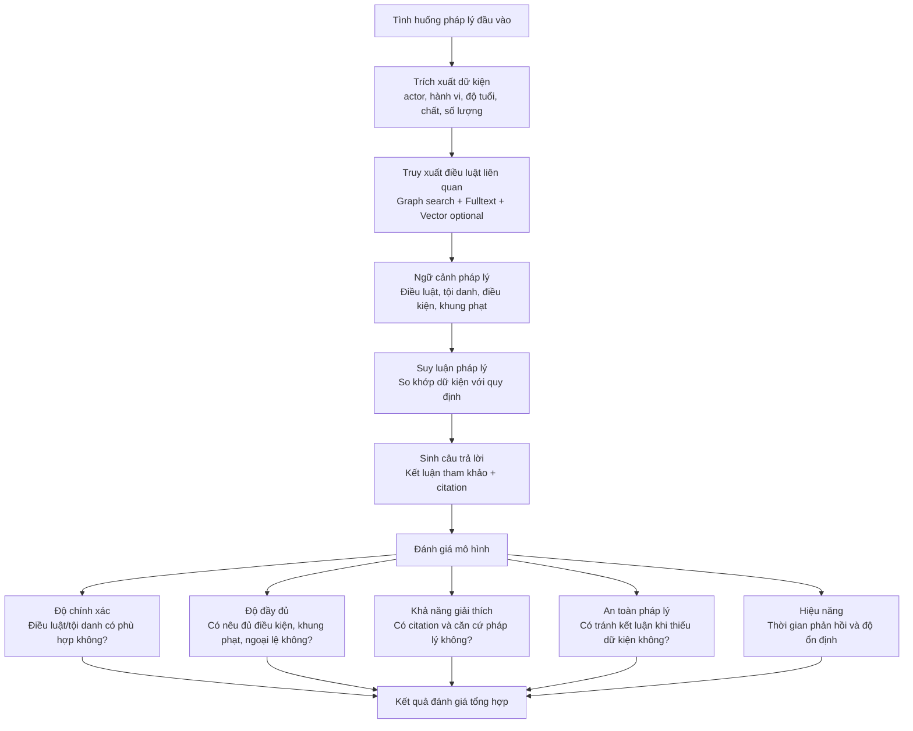

# Nhận xét chung và đánh giá mô hình

## 1. Nhận xét chung

Hệ thống **BLHS Graph Chatbot** được xây dựng theo hướng kết hợp giữa **cơ sở tri thức dạng đồ thị Neo4j** và các kỹ thuật **retrieval augmented generation** để hỗ trợ tra cứu, phân tích tình huống pháp lý hình sự. Điểm mạnh chính của mô hình là không phụ thuộc hoàn toàn vào LLM để suy luận pháp luật, mà sử dụng **Neo4j Graph** làm nguồn dữ liệu pháp lý trung tâm. Nhờ đó, câu trả lời có thể bám vào điều luật, tội danh, điều kiện áp dụng, khung hình phạt và các yếu tố liên quan như tình tiết tăng nặng, giảm nhẹ hoặc ngoại lệ.

Về mặt kiến trúc, hệ thống được chia thành các tầng tương đối rõ ràng: tầng dữ liệu pháp luật, tầng truy xuất thông tin, tầng suy luận pháp lý và tầng sinh câu trả lời. Cách tổ chức này giúp hệ thống dễ mở rộng, dễ kiểm thử và phù hợp với bài toán chatbot pháp lý, nơi yêu cầu tính giải thích được và khả năng truy vết nguồn thông tin là rất quan trọng.

Tuy nhiên, hệ thống vẫn mang tính chất hỗ trợ tham khảo. Một số dữ kiện pháp lý phức tạp như định lượng ma túy, độ tuổi chịu trách nhiệm hình sự, vai trò đồng phạm, yếu tố lỗi, hậu quả hoặc tình tiết định khung vẫn cần được kiểm chứng thủ công. Do đó, mô hình không thay thế kết luận của cơ quan điều tra, viện kiểm sát, tòa án hoặc chuyên gia pháp lý.

## 2. Hình đánh giá mô hình

### 2.1. Dashboard tổng quan số liệu dự án



**Hình. Dashboard tổng quan số liệu của dự án BLHS Graph Chatbot.**

Dashboard này được sinh trực tiếp từ các file trong project hiện tại, gồm `neo4j_import/*.csv`, mã nguồn `backend/app`, test trong `backend/tests` và các file Cypher. Biểu đồ thể hiện quy mô dữ liệu graph, cấu trúc pháp luật, dữ liệu ngữ nghĩa pháp lý, mapping NLP và mức độ bao phủ backend/API.

Các số liệu nổi bật:

- **24.938 dòng dữ liệu graph tĩnh**
- **427 điều luật**
- **4.291 rule**
- **4.290 condition**
- **5.688 ngưỡng định lượng**
- **1.493 khung hình phạt**
- **31 file CSV import**
- **8 API route**

Có thể render lại dashboard tổng quan dự án bằng lệnh:

```powershell
python scripts\generate_project_dashboard.py
```

### 2.2. Sơ đồ quy trình đánh giá mô hình



## 3. Tiêu chí đánh giá

| Tiêu chí | Nội dung đánh giá | Mức đánh giá đề xuất |
|---|---|---|
| Độ chính xác | Hệ thống truy xuất đúng điều luật, tội danh và quy định liên quan | Tốt |
| Độ đầy đủ | Câu trả lời có nêu dữ kiện, điều kiện áp dụng, khung hình phạt và cảnh báo thiếu dữ kiện | Khá tốt |
| Khả năng giải thích | Kết quả có căn cứ từ graph, có citation và có lý do xếp hạng điều luật | Tốt |
| Khả năng xử lý ngôn ngữ tự nhiên | Có thể chuẩn hóa slang, alias hành vi và thuật ngữ đời thường | Khá |
| Khả năng hội thoại nhiều lượt | Có lưu phiên vụ việc, gộp dữ kiện và hỏi lại khi thiếu thông tin | Tốt trong phạm vi demo |
| Tính an toàn | Có cơ chế validator, answer gate và cảnh báo không thay thế kết luận pháp lý chính thức | Tốt |
| Hiệu năng | Phụ thuộc vào Neo4j, số lượng truy vấn, vector search và reranker nếu bật | Trung bình đến tốt |
| Khả năng mở rộng | Có thể mở rộng thêm dữ liệu, thêm index, thêm Redis/PostgreSQL cho session | Tốt |

## 4. Đánh giá ưu điểm

- **Có cơ sở tri thức rõ ràng:** Dữ liệu pháp luật được mô hình hóa thành graph nên dễ truy xuất theo điều luật, tội danh, điều kiện và khung phạt.
- **Giảm rủi ro hallucination:** LLM chỉ đóng vai trò hỗ trợ trích xuất hoặc diễn giải, còn căn cứ pháp lý chính đến từ Neo4j.
- **Có khả năng giải thích:** Câu trả lời có thể kèm citation, điều luật liên quan và lý do suy luận.
- **Hỗ trợ hội thoại nhiều lượt:** Khi tình huống thiếu dữ kiện, hệ thống chưa kết luận ngay mà đặt câu hỏi làm rõ.
- **Thiết kế dễ mở rộng:** Có thể bổ sung vector search, reranker, Redis session store hoặc thêm tập dữ liệu pháp luật khác.

## 5. Đánh giá hạn chế

- **Phụ thuộc chất lượng dữ liệu import:** Nếu dữ liệu từ PDF bị parse sai hoặc thiếu, kết quả truy xuất cũng có thể sai.
- **Một số rule còn heuristic:** Trích xuất điều kiện, ngưỡng định lượng và tín hiệu pháp lý vẫn dựa nhiều vào luật thủ công.
- **Chưa thay thế chuyên gia pháp lý:** Hệ thống chỉ đưa ra phân tích tham khảo, không thể kết luận chính thức về tội danh hoặc khung hình phạt.
- **Session hiện lưu in-memory:** Phù hợp demo/dev nhưng chưa tối ưu cho production nhiều người dùng.
- **Vector search và reranker là tùy chọn:** Nếu chưa bật hoặc chưa có embedding/index, độ bao phủ ngữ nghĩa có thể giảm.

## 6. Kết luận đánh giá

Nhìn chung, mô hình phù hợp với mục tiêu xây dựng một chatbot hỗ trợ tra cứu và phân tích tình huống theo Bộ luật Hình sự. Hệ thống có ưu điểm ở khả năng tổ chức tri thức pháp lý bằng graph, truy xuất có căn cứ, giải thích được và hạn chế kết luận quá mức khi thiếu dữ kiện. Đây là hướng tiếp cận phù hợp hơn so với chatbot chỉ dùng LLM thuần túy, đặc biệt trong lĩnh vực pháp luật vốn yêu cầu độ chính xác và khả năng truy vết cao.

Để nâng cao chất lượng trong tương lai, hệ thống nên được đánh giá trên một bộ test case pháp lý chuẩn, có đáp án đối chiếu từ chuyên gia. Ngoài ra, cần cải thiện chất lượng dữ liệu import, bổ sung kiểm thử định lượng cho retrieval, triển khai session store bền vững và tinh chỉnh thêm các rule xử lý tình huống phức tạp.

