# Bộ sơ đồ dùng cho báo cáo

Tài liệu này tổng hợp các sơ đồ Mermaid mô tả hệ thống **BLHS Graph Chatbot Full Upgrade v1**. Có thể chèn trực tiếp vào báo cáo Markdown hoặc render sang PNG/SVG bằng Mermaid.

## 1. Sơ đồ tổng quan hệ thống

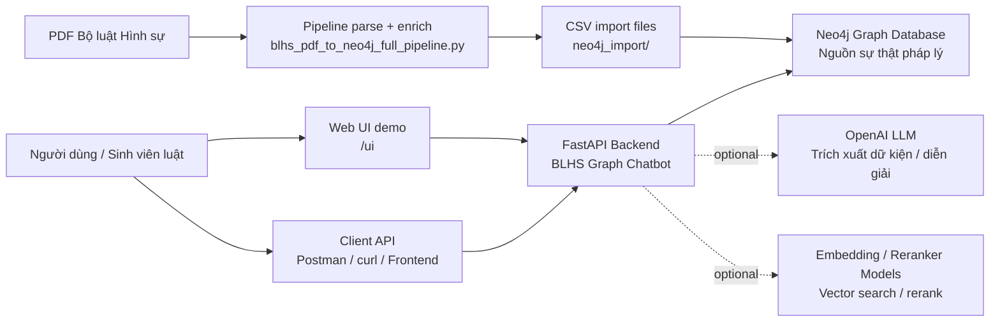

## 2. Sơ đồ triển khai

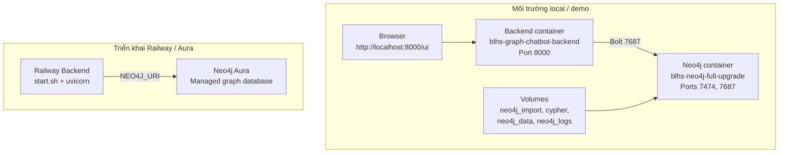

## 3. Sơ đồ pipeline xây dựng dữ liệu

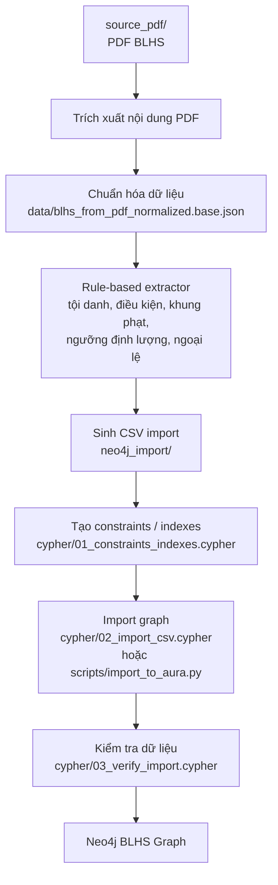

## 4. Sơ đồ tầng dữ liệu pháp lý

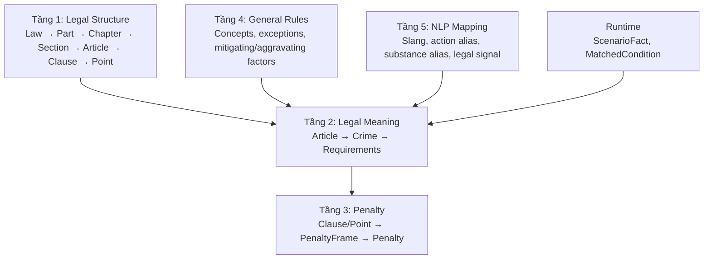

## 5. Sơ đồ graph schema chính

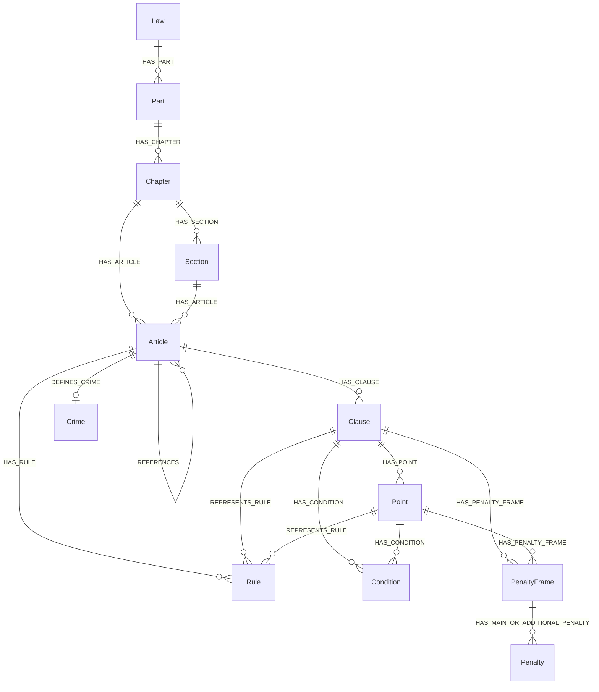

## 6. Sơ đồ yêu cầu cấu thành tội phạm

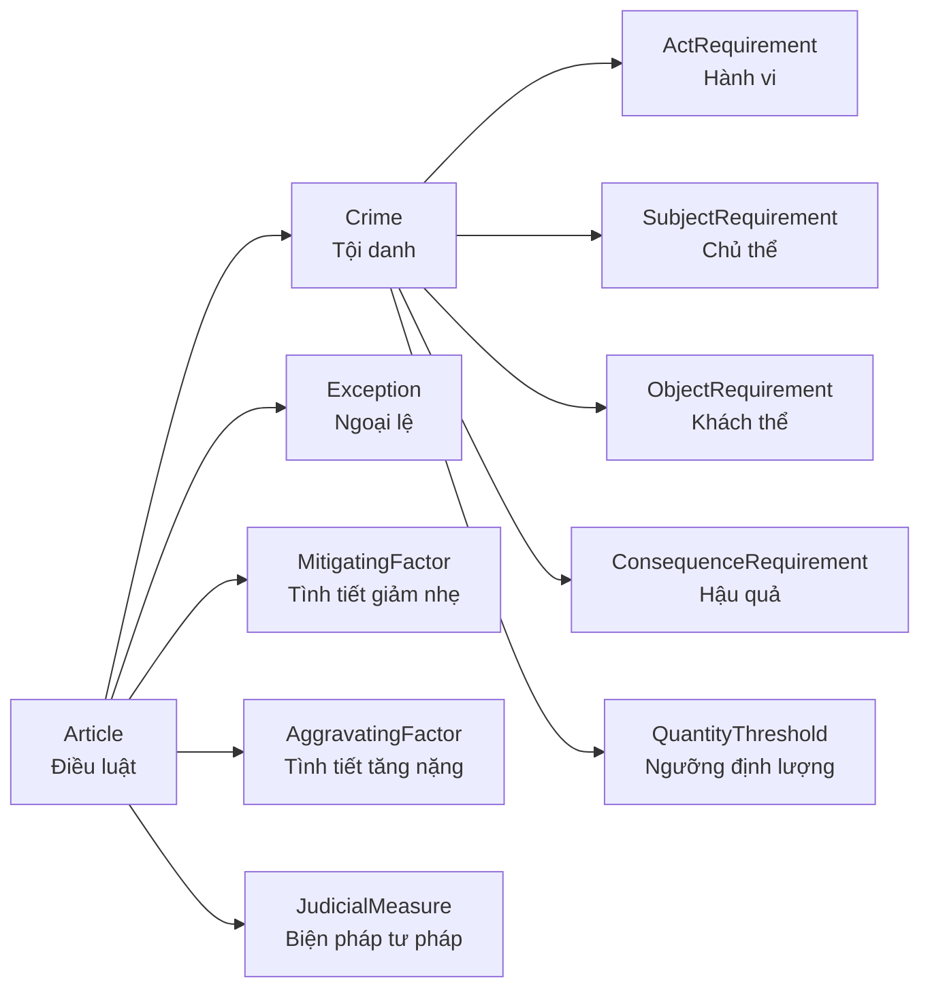

## 7. Sơ đồ NLP mapping

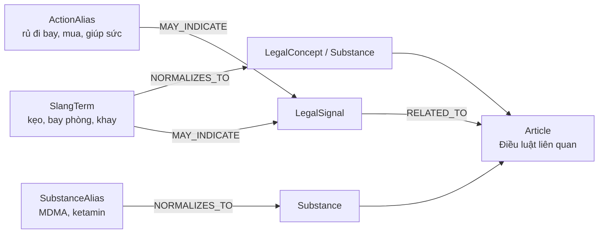

## 8. Sơ đồ kiến trúc backend

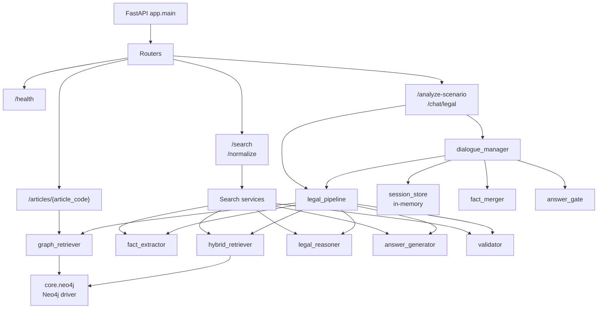

## 9. Sơ đồ luồng phân tích một tình huống

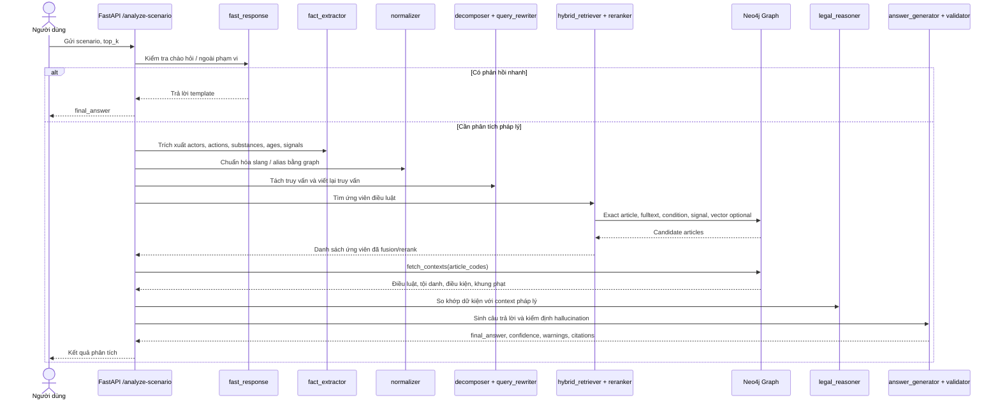

## 10. Sơ đồ luồng chat pháp lý nhiều lượt

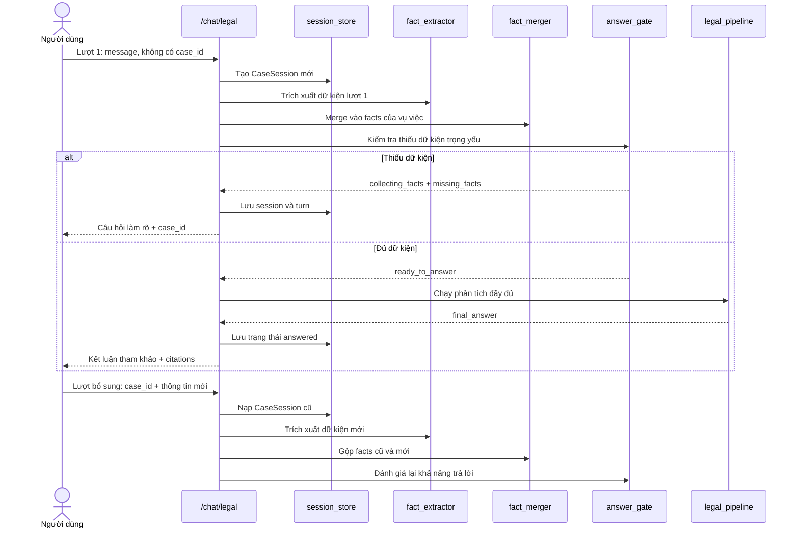

## 11. Sơ đồ hybrid retrieval

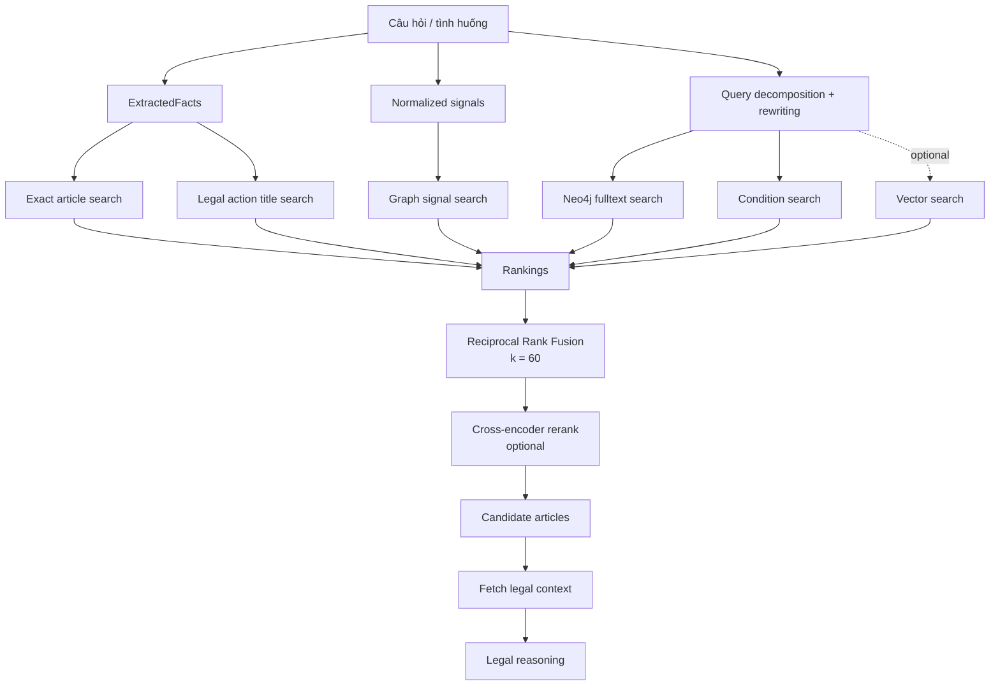

## 12. Sơ đồ kiểm soát chất lượng câu trả lời

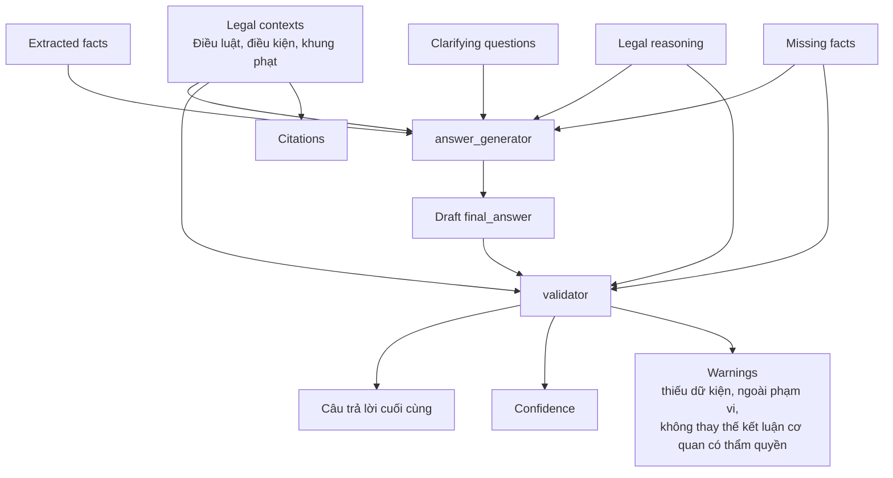

## 13. Sơ đồ use case

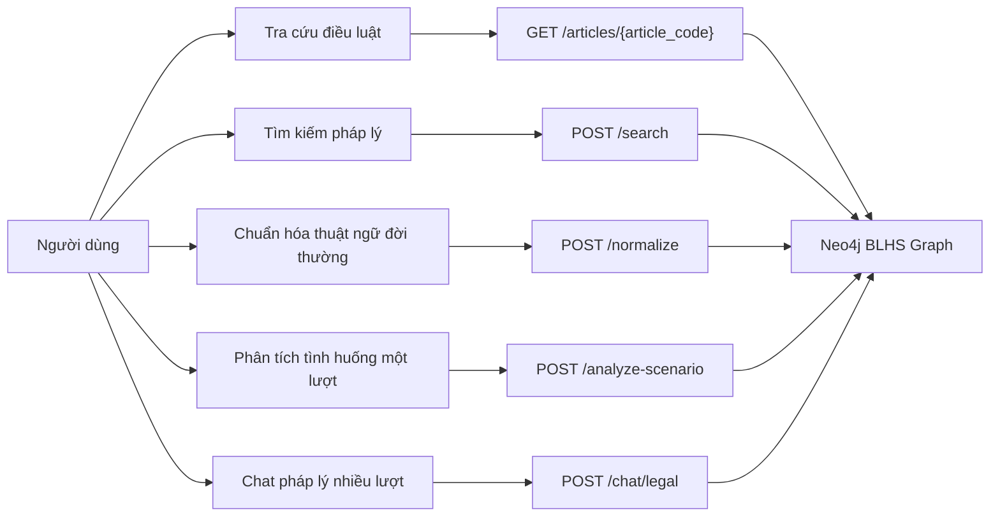

## 14. Sơ đồ trạng thái phiên chat

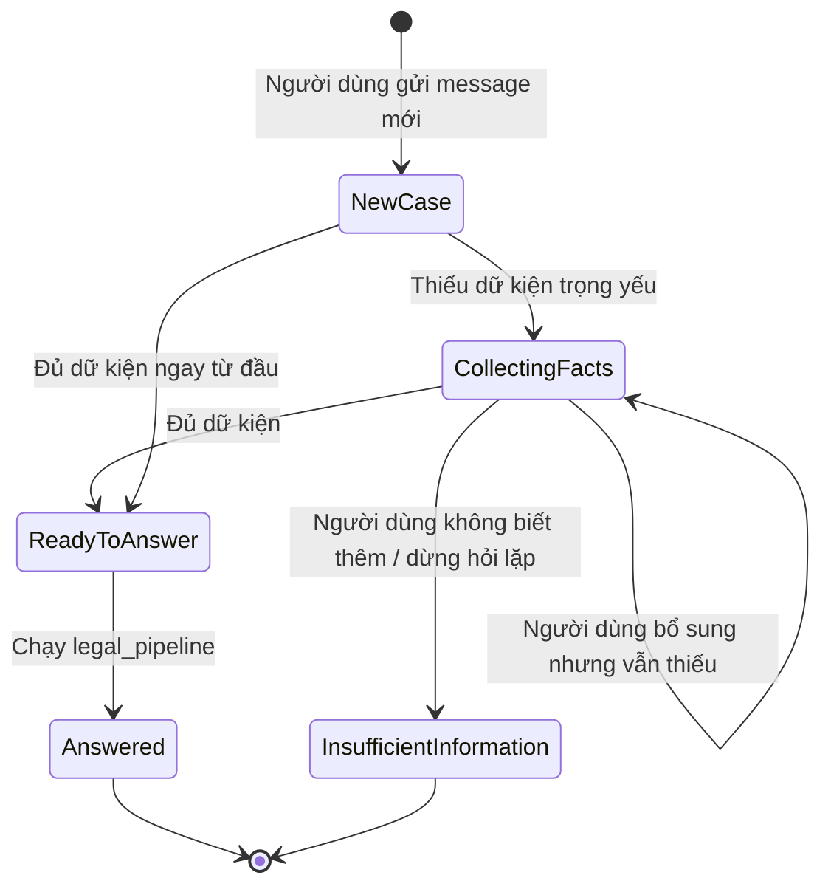

## 15. Sơ đồ bảo vệ chống kết luận quá mức

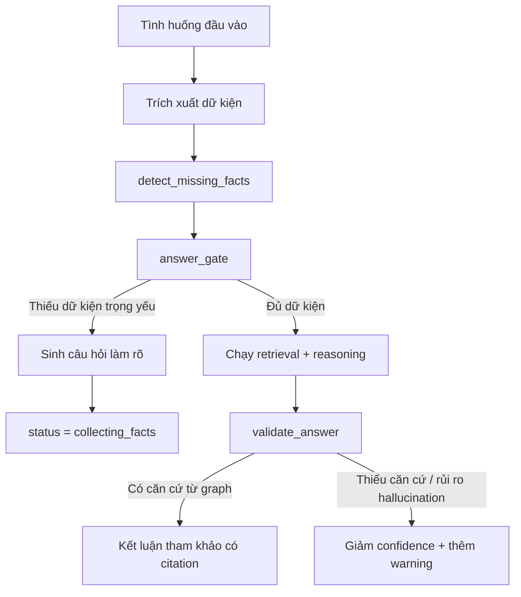

